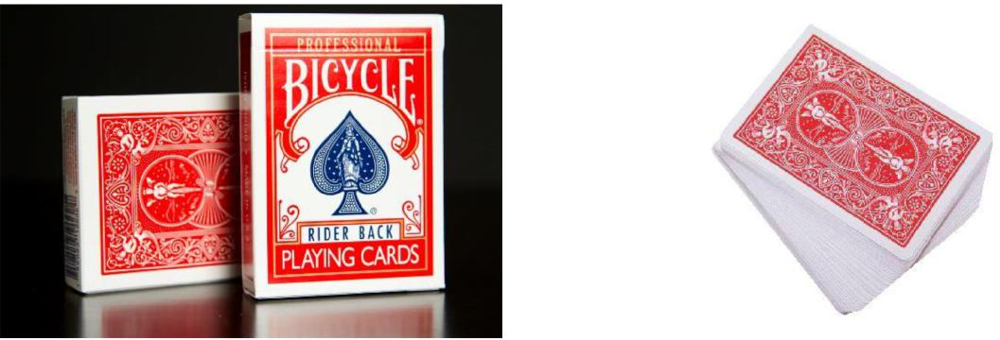
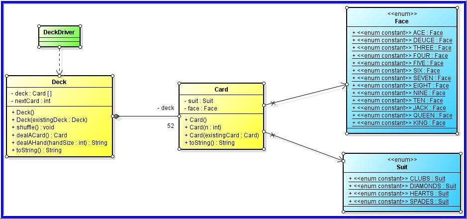

# CSCI 1260 – Project 2 - Part A

## Deck of Cards

**The Exercise**

1.  Using the *Card* class and supporting classes such as *Face* and *Suit* from
    your exercise last week, create a *Deck* class representing a deck of cards.
    The class should demonstrate the *Composition relationship* with the Card
    class as shown in the *UML* diagram. The **composition relationship** here
    says that a *Deck* has an array of *Card* objects as an *attribute* and the
    *Card* objects are created by *Deck’s* constructor. A deck has exactly 52
    cards.

1.  Add a *driver* that creates and displays an entire *Deck* of *Cards*,
    shuffles the *Deck* and displays it again, creates another *Deck* as a copy
    of the first *Deck*, and deals and displays two hands of 7 *Cards* each from
    that second *Deck*. You may discard the driver class from the previous
    exercise and replace it with this one.

**Hints and Other Specifications**

1.  The *Deck’s default constructor* should fill an array of 52 unique *Card*
    objects. Use a loop and pass the loop’s counter to the *Card* constructor as
    its argument.

2.  The *Deck* class should have a *copy constructor* that does a *deep copy*.

3.  The *toString* method should return a string that contains 52 lines – one
    for each of the *Card* objects in the *Deck’s* array of *Card* objects. It
    should use the *Card* class’ *toString* method to do part of the work.

>   **Hint**: create the above 3 methods **FIRST** so that you can use them to
>   test whether other methods are working correctly as you implement them

1.  The *nextCard* attribute is a counter that is initialized by the
    *constructor* to 0 and reset to 0 by the *shuffle* method. It should be
    incremented every time a *Card* is dealt from the *Deck*. It is used
    internally by the *Deck* class to keep track of which of the 52 *Cards* is
    to be dealt next. See below for a diagram.

2.  The *shuffle* method shuffles the array of *Card* objects by looping through
    the array of *Card* objects one position at a time and exchanging (see
    **slides 62-63** of the array lecture) the *Card* in that position with the
    *Card* in a random position (as determined by a *Random* number) between 0
    and 51.

>   To further randomize the order of the cards, one may repeat the full
>   shuffling loop several additional times (equivalent to shuffling a deck of
>   cards by hand several times).

1.  The *dealACard* method returns the *Card* from the array of *Card* objects
    in position *nextCard*. See the diagram below that illustrates how this
    should work.

2.  The *dealAHand* method has a loop that deals one *Card* (*using the previous
    method - dealACard*) at a time until it has dealt *handSize Cards*. The
    *String* returned is a list of the *Card* objects in the hand – similar to
    the result of *toString* except that the *String* returned here contains
    only *handSize Card* objects.
